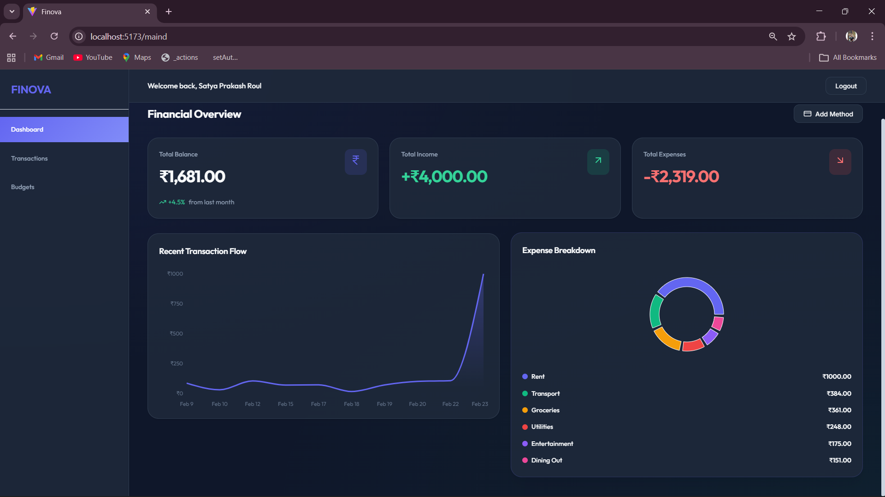
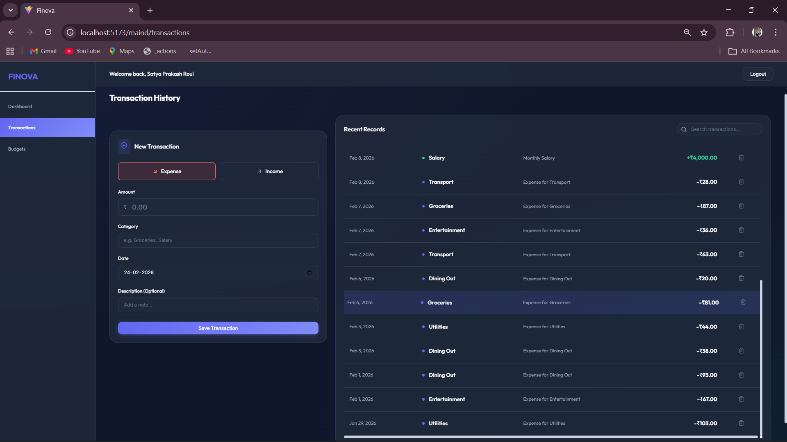
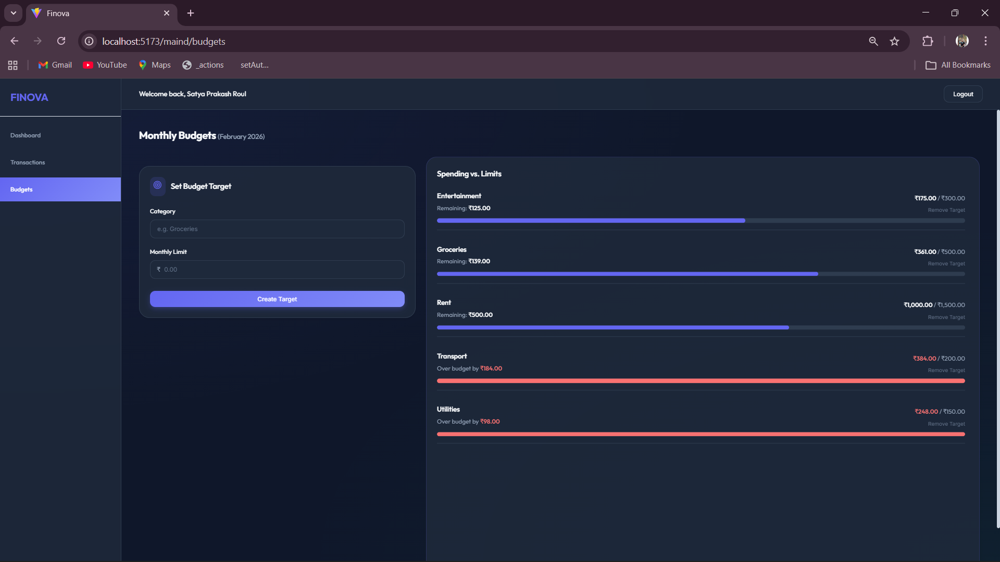

# 🚀 FINOVA - Industrial-Grade Personal Finance Management

FINOVA is a high-performance, secure, and intuitive web application designed for comprehensive personal financial management. Built with the MERN stack (MongoDB, Express, React, Node.js), it provides real-time financial insights, budget tracking, and transaction management with a premium dark-themed interface.

## ✨ Key Features

### 🔐 Advanced Security & Auth
- **JWT-based Authentication:** Secure stateless authentication using JSON Web Tokens.
- **Client-Side Persistence:** Token management via `localStorage` for seamless sessions.
- **Protected Routing:** Role-based access control for secure dashboard interactions.
- **Secure Hashing:** Multi-layer password hashing using `bcryptjs`.

### 💰 Transaction Management
- **Universal Tracking:** Record Income and Expenses with precision.
- **Recurring Logic:** Support for Monthly and Weekly automated transaction tagging.
- **Filtering & Search:** Industrial search engine for transaction lookup by description, category, and date range.

### 📊 Financial Insights
- **Savings Analytics:** Real-time calculation of "Savings Rate" to measure financial health.
- **Dynamic Dashboard:** Balanced overview of Total Income, Expenses, and current Net Worth.
- **Budget Guardrails:** Visual progress bars per category with over-budget alerts.

## 🛠️ Tech Stack

| Component | Technology | Role |
| :--- | :--- | :--- |
| **Frontend** | React 18, Vite | Fast UI/UX rendering & bundling |
| **Routing** | React Router 7 | Client-side navigation |
| **State** | React Context API | Global state for Auth |
| **Styling** | Vanilla CSS3 | Custom high-performance dark theme |
| **Icons** | Lucide React | Premium vector iconography |
| **Backend** | Node.js, Express | High-concurrency API layer |
| **Database** | MongoDB, Mongoose | NoSQL persistence with schema validation |
| **Security** | JWT, bcryptjs | Industry-standard encryption |

## 🏗️ System Architecture

### 📂 Project Structure
```text
FINOVA/
├── client/               # React Frontend
│   ├── src/
│   │   ├── assets/       # Static assets like images
│   │   ├── components/   # Reusable UI components
│   │   ├── context/      # AuthContext provider
│   │   ├── pages/        # Route views (Dashboard, Budgets, Transactions, Login, Register)
│   │   ├── utils/        # Utility functions
│   │   ├── App.jsx       # Main application component
│   │   ├── main.jsx      # React entry point
│   │   └── index.css     # Global styles
│   └── package.json
├── server/               # Express Backend
│   ├── config/           # Database configuration
│   ├── controllers/      # Route handlers (auth, budget, transaction)
│   ├── middleware/       # JWT verification middleware
│   ├── models/           # Mongoose schemas (User, Budget, Transaction)
│   ├── routes/           # API Endpoints
│   ├── utils/            # Utility functions
│   ├── server.js         # Server entry point
│   ├── seed.js           # Database seeding script
│   └── package.json
└── README.md             # Documentation
```

## �️ Frontend Images

Here is a glimpse of the FINOVA application in action:

<div align="center">
  
  
</div>
<div align="center">
  
  
</div>

## �🚦 API Reference

### Authentication
| Method | Endpoint | Description |
| :--- | :--- | :--- |
| `POST` | `/api/auth/register` | Create new user account |
| `POST` | `/api/auth/login` | Authenticate & receive JWT |
| `GET` | `/api/auth/check` | Verify token & get user profile |

### Transactions
| Method | Endpoint | Description | Query Params |
| :--- | :--- | :--- | :--- |
| `GET` | `/api/transactions` | Fetch all logs | `type`, `category`, `startDate`, `endDate`, `search` |
| `POST` | `/api/transactions` | Add new entry | N/A |
| `DELETE` | `/api/transactions/:id` | Remove entry | N/A |

### Budgets
| Method | Endpoint | Description | Query Params |
| :--- | :--- | :--- | :--- |
| `GET` | `/api/budgets` | Fetch monthly goals | `month`, `year` |
| `POST` | `/api/budgets` | Set/Update budget | N/A |

## ⚙️ Installation & Setup

### Prerequisites
- **Node.js**: v18.0.0 or higher
- **NPM**: v9.0.0 or higher
- **MongoDB**: A running instance (Local or Atlas)
- **Git**: For version control

### 1. Clone the repository
```bash
git clone https://github.com/sproul2005/FINOVA.git
cd FINOVA
```

### 2. Backend Configuration
Navigate to the `server` directory and install dependencies:
```bash
cd server
npm install
```

Create a `.env` file in the `server` directory and configure the following:
```env
PORT=5000                     # Port for the Express server
MONGODB_URI=your_mongodb_uri   # Your MongoDB Connection String
JWT_SECRET=your_super_secret   # A secure string for JWT signing
```

Start the backend server (using nodemon for development):
```bash
npm run dev
```
The server will be running at `http://localhost:5000`

### 3. Frontend Configuration
Navigate to the `client` directory and install dependencies:
```bash
cd ../client
npm install
```

Start the development server:
```bash
npm run dev
```
The application will be accessible at `http://localhost:5173`

## 🏃 Getting the App Running

To launch both the frontend and backend environments simultaneously, you'll need to open two separate terminal windows or tabs:

- **Terminal 1 (Backend Server)**: Navigate to the server folder and start the API `cd server && npm run dev`
- **Terminal 2 (Frontend Interface)**: Navigate to the client folder and start the React app `cd client && npm run dev`

## 🧪 Validating the Platform

### Recommended Testing Steps
- **User Authentication Workflow**: Create a new account through the Register page -> confirm the successful redirect to the login screen -> authenticate with the new credentials -> check your browser's Local Storage to ensure the session token is securely saved.
- **Transaction Accuracy**: Log a new income or expense -> navigate to the History view to verify its presence -> check the main Dashboard to ensure the total balances reflect the new entry instantly.
- **Budget Segregation**: Define a spending limit for the current month -> log an expense against it -> define a different limit for the following month -> ensure the new month's budget starts fresh and does not mix with the previous month's data.

---

## 🖼️ Frontend Images

Here is a glimpse of the FINOVA application in action:

<div align="center">
  
  
</div>
<div align="center">
  
  
</div>

